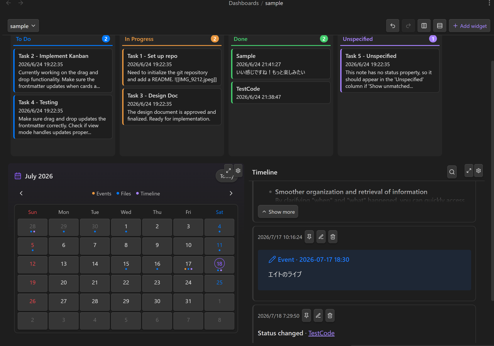
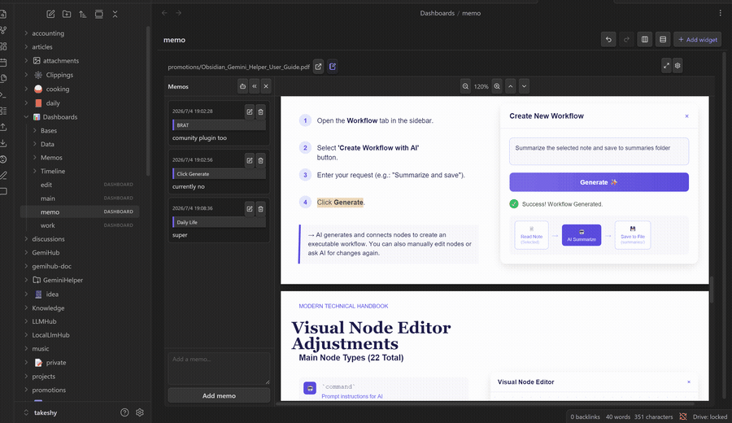

# Dashboard Hub

[English](README.md) | [日本語](README_ja.md)

**Turn your Obsidian vault into a workspace you can see and act on.**

Dashboard Hub brings Obsidian Bases, linked memos for notes, PDFs, and EPUBs,
Kanban boards, Calendars, Timelines, web pages, and password-protected secrets
into one responsive workspace. Plan projects, annotate documents, track events,
and work with your vault without leaving Obsidian.



Dashboard Hub works as a standalone plugin. It does not require an AI account,
an API key, or an external database.

## One screen, many ways to work

- **Build a real home for your vault.** Mix native Obsidian Bases, notes,
  documents, websites, tasks, events, and personal tools in one view.
- **Work directly from the dashboard.** Move a Kanban card and its note
  frontmatter changes. Edit a text file inline. Add a Timeline post or Calendar
  event without navigating away.
- **Make every dashboard your own.** Drag, resize, maximize, and configure
  widgets. Undo and redo changes, or arrange the whole layout into balanced
  rows or columns. Small-screen layouts are derived automatically.
- **Keep ownership of your data.** Dashboards are readable YAML; Timeline posts,
  memos, Kanban definitions, and encrypted secrets live as files in your vault.
  There is no proprietary database to migrate or service to keep running.
- **Use tools on their own, too.** The launcher opens Timeline, Calendar,
  Kanban, MemoList, and Secret Manager even when you do not need a full
  dashboard.



## Built-in widgets

| Widget | What it brings to your dashboard |
| --- | --- |
| **Base** | Obsidian's native Bases tables, cards, and lists, with an editor for the first view. |
| **File** | Markdown, text, HTML, images, PDF, EPUB, code, CSV, and more. Plain-text formats can be edited inline. |
| **Web Embed** | Any embeddable HTTP or HTTPS page, with a quick link to open it in the browser. |
| **Kanban** | Notes grouped by a frontmatter status field. Dragging cards updates the source notes, and board definitions can be reused across dashboards. |
| **Timeline** | A personal chronological feed with tags, wikilinks, pinned posts, filters, and image attachments. |
| **Calendar** | Events and activity from a Timeline, collected into a monthly view with day details. |
| **MemoList** | A searchable index of reading memos collected from files across the dashboard. |
| **Secret Manager** | Password-protected `.encrypted` files that can be searched, unlocked, copied, and edited in place. |
| **Workflow** | Run a connected Hub workflow and keep its Markdown or HTML output on the dashboard. |

## Read, annotate, and return to the source

The File widget makes a dashboard useful as a reading workspace, not just an
overview. Open a PDF, EPUB, Markdown note, or other vault file; select a passage;
then save a memo with its quote context. Saved ranges are highlighted while the
memo panel is open, and links can jump back to the quoted text. MemoList gathers
those annotations into one searchable index.


## Get started

1. Install and enable Dashboard Hub.
2. Run **Dashboard Hub: Create dashboard** from the command palette, or open the
   rocket launcher in the ribbon.
3. Choose **Add widget**, configure a widget, and drag or resize it into place.

Edits are saved automatically. The default **Base directory** is `Dashboards`;
you can change it in Dashboard Hub settings. New dashboards and their supporting
files use these locations below that directory:

```text
Dashboards/
├── *.dashboard             # YAML dashboard definitions
├── Bases/                  # Obsidian .base files
├── Kanbans/                # Reusable .kanban definitions
├── Memos/                  # Reading memos
└── Timeline/<name>/        # Timeline posts and attachments
```

Secret Manager uses `.encrypted` files under `Secrets/` by default. Each file
contains its own password-protected private key and salt, so the password is all
you need to unlock it. Changing the Base directory does not move existing files.

## Install from source

Dashboard Hub requires Obsidian 1.10.0 or later.

```bash
npm install
npm run build
```

Copy `main.js`, `manifest.json`, and `styles.css` into:

```text
<your-vault>/.obsidian/plugins/dashboard-hub/
```

Then reload Obsidian and enable **Dashboard Hub** under Community plugins.

## Development

```bash
npm test
npm run build
```
