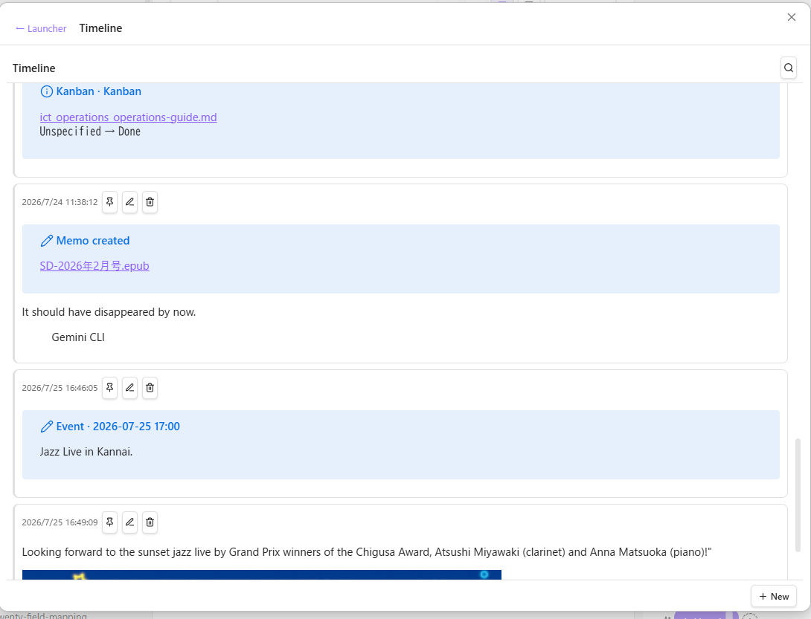
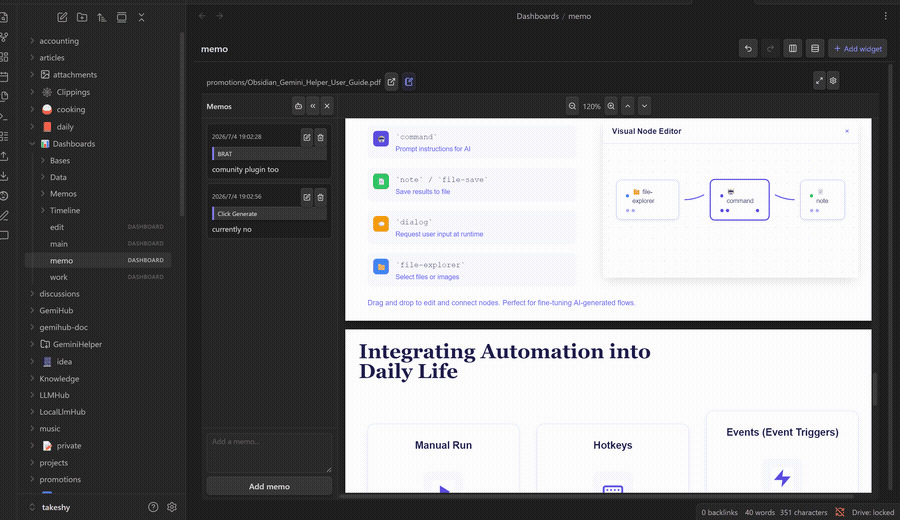
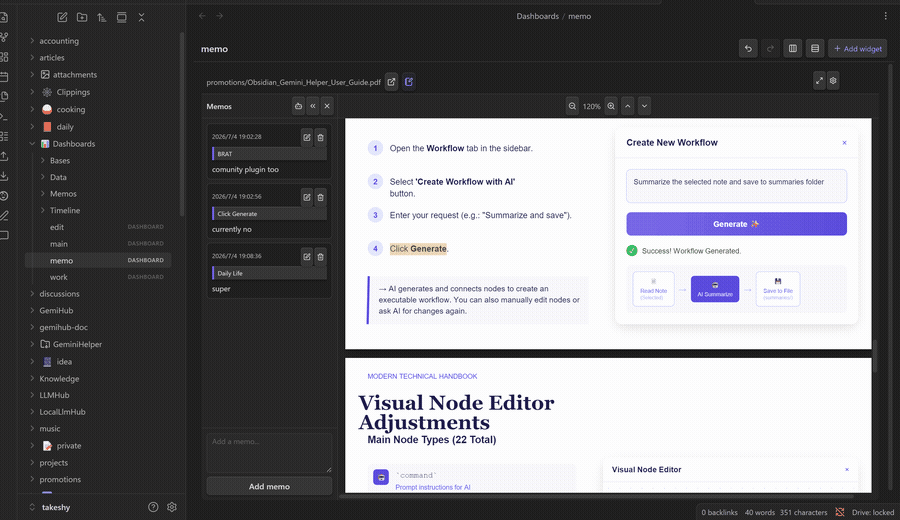
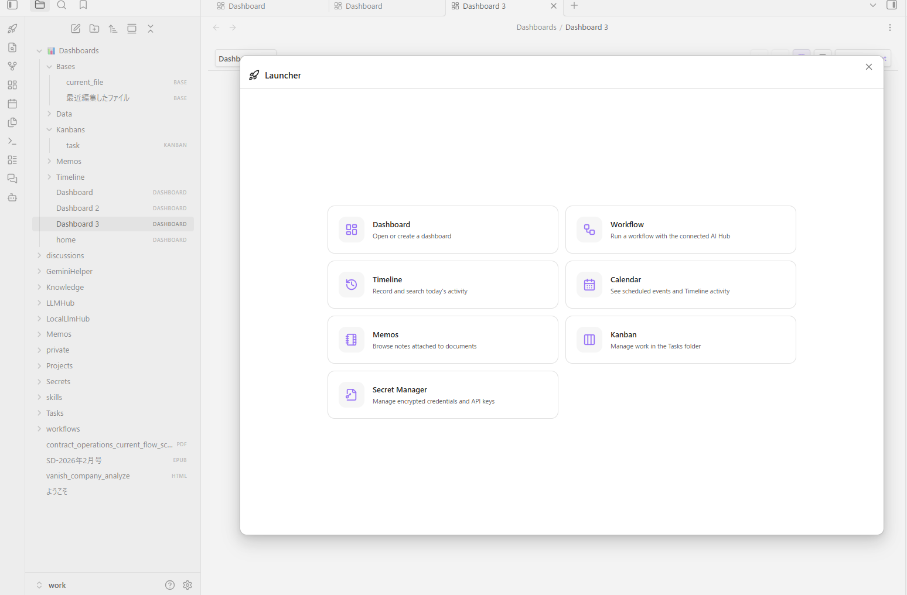

# Dashboard Hub

[English](README.md) | [日本語](README_ja.md)

Dashboard Hubは、Obsidian Bases、ファイル、Kanban、Calendar、Timeline、Webページ、
読書メモ、暗号化ファイルを1つの画面にまとめるプラグインです。Kanbanカードの移動や
メモの保存など、対応する操作を日付ごとのMarkdownへ記録することもできます。


AIアカウント、APIキー、外部データベースがなくても動作します。

## アクティビティTimeline

Timelineには直接投稿でき、タグ、Wikiリンク、ピン留め、フィルター、画像添付を使えます。
次の操作は自動記録にも対応しています。

| 操作 | Timelineに記録される内容 |
| --- | --- |
| Kanbanカードを別の列へ移動 | ボード名、ノートへのリンク、`変更前の状態` → `変更後の状態` |
| Calendarの予定日を変更 | 予定の概要、`変更前の日付` → `変更後の日付` |
| 読書メモを作成・編集・削除 | 操作、元文書へのリンク、引用を含むメモ |
| 自分で投稿を書く | メモ、取り組んでいること、考えを変えた理由など、書いた内容そのもの |



記録先は `<Base directory>/Timeline/<name>/YYYY-MM-DD.md` で、1日1ファイルです。
Calendarは指定したTimelineの予定と投稿を月表示します。メモ、Kanban、Calendarの
自動記録先は、設定の **Activity Timeline name** で変更できます。初期値は `Timeline` です。

## Secret Manager

APIキーやトークンなどを `.encrypted` ファイルとして保存します。標準の保存先は
`Secrets/` です。名前や公開メタデータで検索でき、値のコピーと編集に対応しています。
入力したパスワードはセッション中だけメモリに保持します。

暗号化にはハイブリッド方式を使います。公開鍵があればパスワードなしで暗号化できますが、
復号にはパスワードで保護された秘密鍵が必要です。専用のパスワードマネージャーを
置き換えるものではありません。

## 読書メモ

FileウィジェットでPDF、EPUB、Markdownノートを開き、選択した文章を引用付きメモとして
保存できます。メモパネルを開くと保存範囲がハイライトされ、メモから引用元へ移動できます。
MemoListではメモを横断検索できます。メモの作成、編集、削除はTimelineにも記録されます。



## ダッシュボードとレイアウト

ウィジェットは移動、リサイズ、最大化、個別設定が可能です。レイアウトのUndo・Redo、
行または列への均等配置にも対応しています。小さい画面向けのレイアウトは自動生成され、
変更内容は随時保存されます。



ダッシュボードはYAML形式の `.dashboard` ファイルです。ほかのVaultファイルと同様に、
内容の確認、バージョン管理、検索、バックアップができます。

## ウィジェット

| ウィジェット | ダッシュボードに追加される機能 |
| --- | --- |
| **Timeline** | 他のウィジェットによる自動記録と自分の投稿をまとめたアクティビティログ。タグ、Wikiリンク、ピン留め、フィルター、画像添付に対応します。 |
| **Calendar** | Timelineの予定とアクティビティを月間表示へまとめます。予定日の変更もTimelineへ記録します。 |
| **Kanban** | frontmatterのステータスでノートを分類します。カードの移動は元ノートを更新し、変更を記録します。ボード定義は複数のダッシュボードで再利用できます。 |
| **Secret Manager** | パスワード保護された `.encrypted` ファイルを検索、解除、コピー、その場で編集できます。secretごとのメタデータにも対応します。 |
| **File** | Markdown、テキスト、HTML、画像、PDF、EPUB、コード、CSVなどを表示します。プレーンテキストは直接編集でき、PDF、EPUB、Markdownでは引用と結び付いたメモを作成できます。 |
| **MemoList** | 設定したBase directory以下に保存された読書メモの検索可能な一覧です。 |
| **Base** | Obsidian標準のBasesをテーブル、カード、リストで表示し、先頭ビューを編集できます。 |
| **Web Embed** | 埋め込み可能なHTTPまたはHTTPSページを表示し、ブラウザーで開くリンクも提供します。 |
| **Workflow** | 連携したHubのWorkflowを実行し、MarkdownまたはHTMLの出力をダッシュボードへ保持します。 |

ランチャーからDashboard、Workflow、Timeline、Calendar、MemoList、Kanban、
Secret Managerを直接開けます。



## はじめる

1. Dashboard Hubをインストールして有効にします。Obsidian 1.10.0以降が必要です。
2. リボンのロケットランチャーを開くか、コマンドパレットから
   **Dashboard Hub: Create dashboard** を実行します。
3. **Add widget** を選択して設定し、目的の場所へ移動またはリサイズします。

標準の **Base directory** は `Dashboards` です。プラグイン設定から変更できます。
新しいダッシュボードと関連ファイルは次の場所に保存されます。

```text
Dashboards/
├── *.dashboard             # YAML形式のダッシュボード定義
├── Bases/                  # Obsidianの.baseファイル
├── Kanbans/                # 再利用可能な.kanban定義
├── Memos/                  # 読書メモ
└── Timeline/<name>/        # 1日1ファイルのアクティビティログと添付ファイル
```

Secret Managerは標準では `Secrets/` 以下の `.encrypted` ファイルを使用します。
Base directoryを変更しても既存ファイルは移動されません。

インターフェースは英語、日本語、スペイン語、フランス語、中国語、韓国語、ポルトガル語、
イタリア語、ドイツ語に対応しています。

## オプション：AI機能を追加する

AI機能は任意です。Obsidianのコミュニティプラグインから、次のいずれかを追加できます。

**[Gemini Helper](https://github.com/takeshy/obsidian-gemini-helper)**、
**[Local LLM Hub](https://github.com/takeshy/obsidian-local-llm-hub)**、または
**[LLM Hub](https://github.com/takeshy/obsidian-llm-hub)**

連携プラグインはAIモデルを提供します。選択範囲や読書メモについての質問、Baseの
生成・編集、Timeline投稿の書き換え、Workflowの作成・編集・実行に利用できます。

Dashboard HubはBase directoryとアクティビティTimeline名を連携プラグインへ渡します。
日付を指定した質問では、履歴全体ではなく該当日のMarkdownファイルだけを読み取ります。

## ソースからインストール

```bash
npm install
npm run build
```

`main.js`、`manifest.json`、`styles.css` を次のディレクトリへコピーします。

```text
<your-vault>/.obsidian/plugins/dashboard-hub/
```

Obsidianを再読み込みし、コミュニティプラグインから **Dashboard Hub** を有効にします。

## 開発

```bash
npm test     # vitest
npm run build
```

## ライセンス

MIT
